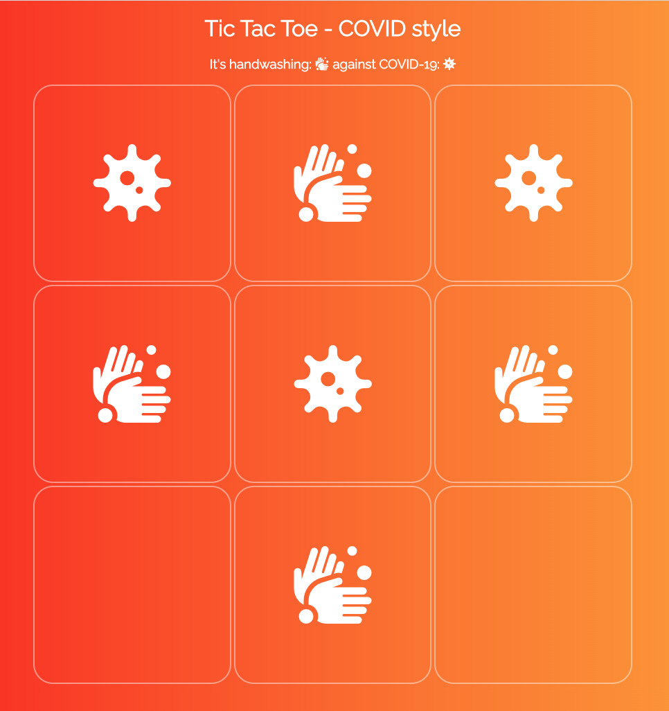

# README - Tic-Tac-Toe

[URL](https://robertmtpaul.github.io/tictactoe/)

This is a simple Tic-Tac-Toe game played in the browser, powered by HTML, CSS and JavaScript with jQuery for DOM manipulation. 

The game must be played in a browser, and has been verified to work in Chrome, Firefox and Safari browsers at this time.

The user tokens are a handwashing icon and virus icon instead of the traditional 'X' and 'O'. 

**How was the game built?**

I have used conditional logic in JavaScript on jQuery targeted DOM elements to see if the user has clicked a box. A global variable `numberOfTurns` checks how many turns have been taken and switches between the tokens based on the number of turns. 

The conditional logic further checks for a winning combination of moves by seeing if all boxes are of equal value, on every click event. Each time a user clicks, a click event checks with conditional logic if all turns have been taken and displays a CSS modal window notifying the users if so.

A user is prevented from double clicking a box by a conditional statement that checks to see if the box is filled, and if so, does not allow a token to be added to the box.

The grid resets at the end of the game: when a player wins or there is a draw. The game is reset by using jQuery to target the DOM elements and give them a value of an empty string, reset the `didTheyWin` boolean value, and reset `numberOfTurns` to `0`.

**How do you install/play Tic-Tac-Toe?**

1. To install the game, you just need to use a web browser to open the index.html file or visit the game at https://robertmtpaul.github.io/tictactoe/. 
    1. The currently supported browsers are Chrome, Mozilla Firefox and Safari.

1. The game can be played by two players who take turns to add their token, a handwashing icon or a virus icon to a 3x3 grid, and try to get a winning combination.

- A winning combination is three icons horizontally, vertically, or diagonally. The game ends when the players get a winning combination or all boxes in the grid are filled.

**Known bugs**

- When the browser window is resized, the icons display too large, i.e. outside of the grid. When the browser window is fully expanded, the icons display much smaller than the grid boxes.

- The game currently is not optimised for small mobile phone screens, so the grid & icons display incorrectly.

**Unsolved problems/matters**

- It's currently not possible to keep track of how many times each user has won the game; this is a feature that will be added in time.

- The game must be played by two people, and there is no AI opponent users can play against, yet. 
